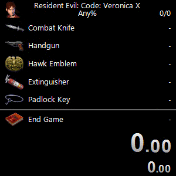

# Resident Evil/Biohazard: Code: Veronica Auto Splitter

A [LiveSplit](https://livesplit.org/) Auto Splitter for Resident Evil/Biohazard: Code: Veronica for RPCS3, PCSX2 and Dolphin
emulators. This Auto Splitter allows you to create splits for item pickups and
compare against in game time. Additionaly, character health, poison status and
equipped weapon ammo can be displayed in LiveSplit with the
[ASL Var Viewer](https://github.com/hawkerm/LiveSplit.ASLVarViewer) component.

*Last Update: 2023-05-06T20:00:00+1200*

## Extras

Right click and Save As to download extra files.

- [Sample Splits](https://raw.githubusercontent.com/kapdap/re-cvx-autosplitter/master/splits/Resident%20Evil%20Code%20Veronica.lss)
- [Sample Layout](https://raw.githubusercontent.com/kapdap/re-cvx-autosplitter/master/splits/Resident%20Evil%20Code%20Veronica.lsl)

## Supported Games
The following emulators and game releases are currently supported.

### [RPCS3](https://rpcs3.net/)
PlayStation 3 releases:
- [**NPJB00135**] [JP] Biohazard: Code: Veronica Kanzenban
- [**NPUB30467**] [US] Resident Evil: Code: Veronica X HD
- [**NPEB00553**] [EU] Resident Evil: Code: Veronica X

### [PCSX2](https://pcsx2.net/)
PlayStation 2 releases:
- [**SLPM-650.22**] [JP] Biohazard: Code: Veronica Kanzenban
- [**SLUS-201.84**] [US] Resident Evil: Code: Veronica X
- [**SLES-503.06**] [EU] Resident Evil: Code: Veronica X

### [Dolphin](https://dolphin-emu.org/)
GameCube releases:
- [**GCDJ08**] [JP] Biohazard: Code: Veronica Kanzenban
- [**GCDE08**] [US] Resident Evil: Code: Veronica X
- [**GCDP08**] [EU] Resident Evil: Code: Veronica X

## Announcement Links

- [SRC Forums - Auto Splitter now available in LiveSplit!](https://www.speedrun.com/cvx/thread/8raeo)

## Acknowledgements

* [Jujstme](https://github.com/Jujstme/) - Improved Dolphin support.